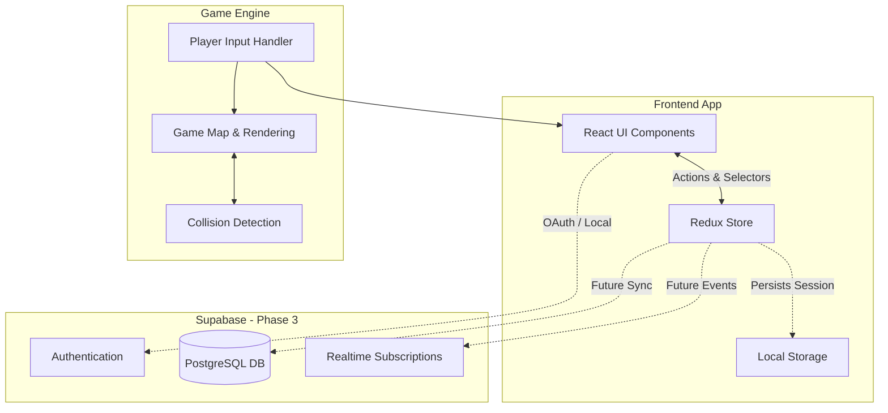
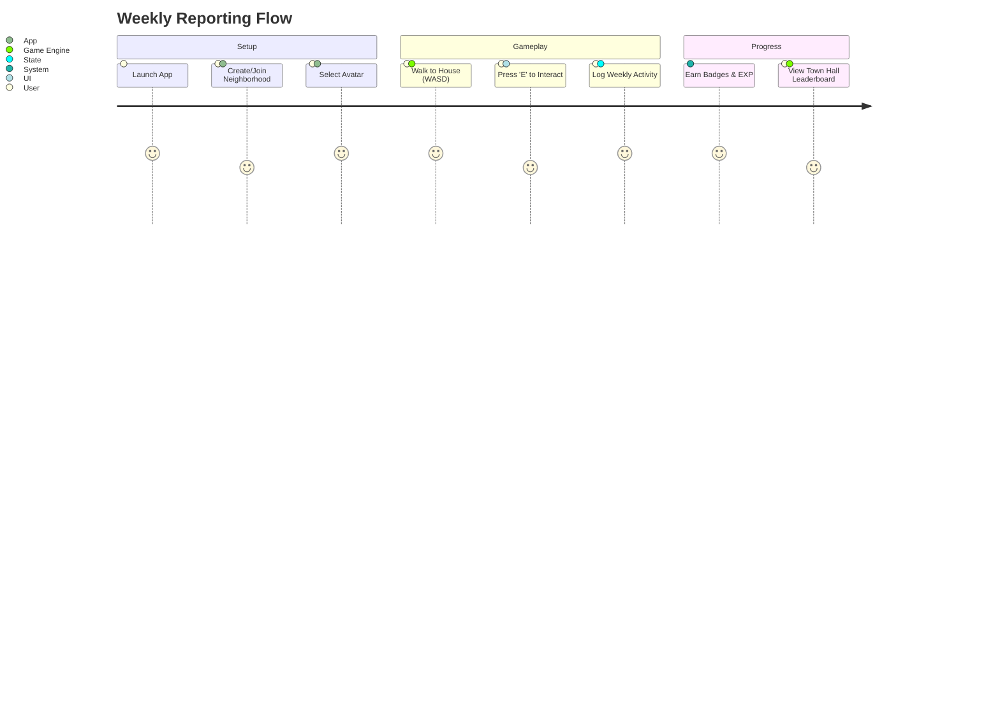
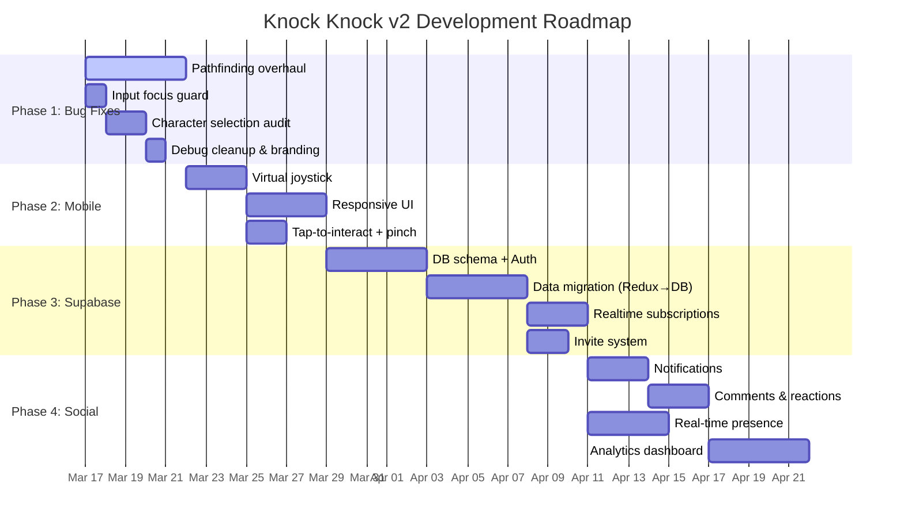

# Knock Knock, Shippers! 🏘️

A gamified team management and weekly task reporting system that transforms boring status updates into an engaging neighborhood experience.

## 🎮 Game Overview

"Knock Knock, Shippers!" is an innovative approach to team coordination where traditional weekly reporting becomes an immersive pixel-art game. Team members live in a virtual neighborhood, each with their own house and activity board, creating transparency and engagement around weekly accomplishments.

### Key Features

- **🏠 Virtual Neighborhood**: Each team member gets their own house with a customizable activity board.
- **📋 Gamified Reporting**: Transform weekly task updates into an engaging game experience.
- **🎯 Priority-Based Tasks**: Rank activities by personal pride and priority levels.
- **🏆 Achievement System**: Earn badges for consistent reporting, early submissions, and team collaboration.
- **📊 Team Analytics**: View team performance through the Town Hall leaderboard.
- **💬 Peer Interaction**: Comment and react to teammates' accomplishments.
- **🎨 Professional Pixel Art**: High-quality retro aesthetic with smooth animations.

## 🏗️ System Architecture & Data Flow



## 🔄 User Journey



## 🎯 How It Works

1. **Create or Join**: Start a new neighborhood as a team lead or join an existing one with an invitation code.
2. **Explore**: Walk around the neighborhood using WASD keys to visit teammates' houses.
3. **Report Weekly**: Update your activity board every Friday with accomplished tasks.
4. **Categorize Tasks**: Organize activities as Project, Ad Hoc, or Routine work.
5. **Engage**: View teammates' boards, leave comments, and react to their achievements.
6. **Progress**: Earn badges and watch your house level up based on activity and engagement.

## 🎮 Game Controls

- **WASD**: Move your character around the neighborhood
- **Arrow Keys**: Pan the camera to explore the map
- **E / Space**: Interact with houses, boards, and the Town Hall
- **L**: Toggle the team leaderboard
- **ESC**: Close open dialogs and forms
- **+/- Buttons**: Zoom in and out of the map

## 🛠️ Technology Stack

### Current Implementation (V1)
- **Frontend**: React 18, TypeScript, Vite
- **State Management**: Redux Toolkit
- **Styling**: Tailwind CSS, Framer Motion
- **Icons**: Lucide React

### Target Architecture (V2)
- **Backend & Auth**: Supabase
- **Real-time Engine**: Supabase Presence & Broadcast
- **Data Fetching**: React Query / SWR

## 🚀 Getting Started

### Prerequisites
- Node.js 18+ and npm

### Installation

1. Clone the repository:
```bash
git clone https://github.com/fachrynuzuli/knock-knock.git
cd knock-knock
```

2. Install dependencies:
```bash
npm install
```

3. Start the development server:
```bash
npm run dev
```

4. Open your browser to `http://localhost:5173`

## 🎯 Development Roadmap (V2)



## 🤝 Contributing

We welcome contributions! Please see our contributing guidelines for details on:
- Code style and conventions
- Pull request process
- Issue reporting
- Feature requests

## 📄 License

This project is licensed under the MIT License - see the LICENSE file for details.

---

**Built with ❤️ for teams who want to make reporting actually enjoyable**

*Transform your team's weekly check-ins from mundane status updates into an engaging neighborhood experience where every accomplishment matters.*