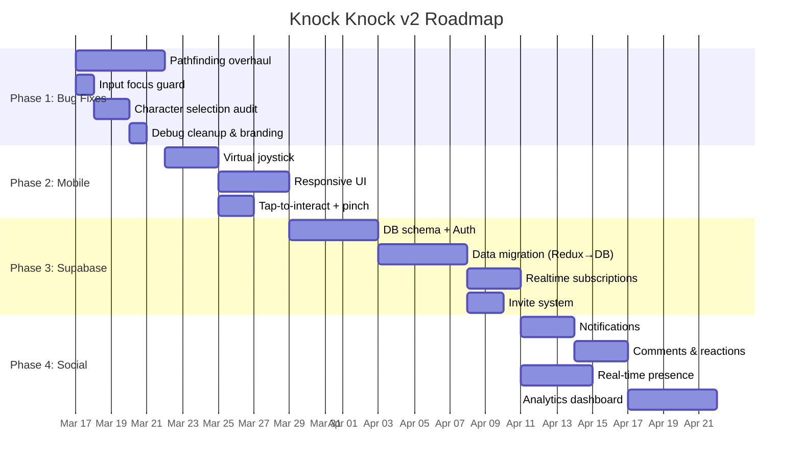

# PRD: Knock Knock, Shippers! v2 — Stability, Mobile, & Social Platform

## 1. Introduction / Overview

**Knock Knock, Shippers!** is a gamified team management app where weekly task reporting happens inside a pixel-art virtual neighborhood. Team members walk around an interactive map, visit each other's houses, log activities, and earn badges.

The app currently works as a **frontend-only prototype** built with React + Redux + Vite. All data (teammates, activities, badges) is hardcoded or stored in `localStorage`. The map uses a single background image with manually placed collision rectangles that don't fully match the visual terrain.

**This PRD defines a phased plan** to take the app from prototype to production-quality product — fixing critical bugs first, then adding mobile support, real-time multiplayer via Supabase, and enhanced social/analytics features.

---

## 2. Goals

| # | Goal | Metric |
|---|------|--------|
| G1 | Fix all critical gameplay bugs (pathfinding, keyboard conflicts, character selection) | 0 known P0/P1 bugs |
| G2 | Make the app fully playable on mobile devices | Lighthouse mobile score ≥ 80, touch controls functional |
| G3 | Persist all data in Supabase (auth, activities, badges, neighborhoods) | 0 reliance on `localStorage` for core data |
| G4 | Enable real-time multiplayer (see teammates' cursors, live activity updates) | Real-time presence working with ≤ 500ms latency |
| G5 | Strengthen social features (notifications, reactions, comments) | Users can comment/react on teammates' boards |
| G6 | Deliver actionable team analytics via the Town Hall | Team leads can view weekly/monthly trends |

---

## 3. User Stories

### Phase 1 — Bug Fixes & Polish
- **US-1.1**: As a player, I want my character to **only walk on paths** so the world feels believable.
- **US-1.2**: As a player, I want to type in forms **without accidentally triggering shortcuts** (e.g., pressing "L" shouldn't open the leaderboard while I'm typing).
- **US-1.3**: As a new player, I want a **clear character selection flow** where I can choose my avatar, name, and neighborhood before entering the game.
- **US-1.4**: As a player, I want **no debug console.log statements** cluttering the browser console.

### Phase 2 — Mobile Responsiveness
- **US-2.1**: As a mobile user, I want **touch-based movement controls** (virtual joystick or swipe) so I can play on my phone.
- **US-2.2**: As a mobile user, I want the **UI to be responsive** — HUD, forms, modals, and leaderboard should adapt to small screens.
- **US-2.3**: As a mobile user, I want to **interact with houses and objects via tap** instead of keyboard shortcuts.

### Phase 3 — Supabase Backend Integration
- **US-3.1**: As a user, I want to **sign up and log in** so my progress is saved across devices.
- **US-3.2**: As a team lead, I want to **create a neighborhood and invite teammates** via a shareable code.
- **US-3.3**: As a player, I want my **activities, badges, and house level persisted** in a database.
- **US-3.4**: As a player, I want to see **real-time updates** when a teammate submits their weekly activities.

### Phase 4 — Social & Analytics
- **US-4.1**: As a player, I want to **receive notifications** when teammates update their boards.
- **US-4.2**: As a player, I want to **react to and comment** on teammates' activities.
- **US-4.3**: As a team lead, I want a **dashboard in the Town Hall** showing weekly/monthly activity trends, category breakdowns, and engagement scores.
- **US-4.4**: As a player, I want to **see other players moving around** the neighborhood in real-time.

---

## 4. Functional Requirements

### Phase 1 — Bug Fixes & Polish

| # | Requirement | File(s) Affected |
|---|------------|-----------------|
| FR-1.1 | **Pathfinding collision overhaul**: Replace the current AABB-rectangle collision system with a **walkability mask** (e.g., a same-size image where white = walkable, black = blocked) derived from the map image. The `canMoveTo()` function in `Game.tsx` should sample the mask at the player's position. | `Game.tsx`, `gameObjects.ts`, new `walkabilityMask.ts` |
| FR-1.2 | **Input focus guard**: In `Game.tsx`, the `handleKeyDown` listener (line 238) must check whether the active element is an `<input>`, `<textarea>`, or `[contenteditable]`. If so, skip all game keybinds (WASD, L, E, Space, Escape). | `Game.tsx` |
| FR-1.3 | **Character selection logic audit**: Review `IntroScreen.tsx` and `AvatarCarousel.tsx` to ensure the selected avatar ID is correctly passed through `updatePlayerInfo()` → stored in Redux → used by `Player.tsx` sprite rendering. Fix any mismatch between `avatarId` and sprite sheet lookup. | `IntroScreen.tsx`, `AvatarCarousel.tsx`, `avatars.ts`, `Player.tsx` |
| FR-1.4 | **Remove debug logging**: Remove all `console.log`/`console.error` debug statements from production code in `Player.tsx` (line 32-37), `teammatesSlice.ts` (lines 146, 156, 182-191), and any other files. | Multiple |
| FR-1.5 | **Remove Bolt.new branding**: Remove the spinning "Built with Bolt" logo from `App.tsx` (lines 124-132) and the "MADE IN BOLT" watermark visible in the bottom-left corner. | `App.tsx`, potentially `index.css` |

### Phase 2 — Mobile Responsiveness

| # | Requirement |
|---|------------|
| FR-2.1 | Implement a **virtual joystick** component (bottom-left) for touch-based character movement. Use touch events (`touchstart`, `touchmove`, `touchend`). |
| FR-2.2 | Add **tap-to-interact**: When a player taps on a nearby house or the Town Hall, trigger the same action as pressing E. |
| FR-2.3 | Make all UI components (**GameHUD**, **ActivityForm**, **ActivityBoard**, **Leaderboard**) responsive using CSS media queries or container queries. Target breakpoints: 375px (phone), 768px (tablet), 1024px+ (desktop). |
| FR-2.4 | Add a **mobile detection** utility that shows/hides the virtual joystick and adjusts the HUD layout accordingly. |
| FR-2.5 | Implement **pinch-to-zoom** for the game map on mobile. |

### Phase 3 — Supabase Backend

| # | Requirement |
|---|------------|
| FR-3.1 | Set up **Supabase project** with tables: `profiles`, `neighborhoods`, `neighborhood_members`, `activities`, `badges`, `comments`, `reactions`. |
| FR-3.2 | Implement **Supabase Auth** (email/password + OAuth) replacing `localStorage`-based user detection in `App.tsx`. |
| FR-3.3 | Implement **Row Level Security (RLS)** policies so users can only modify their own data but read their neighborhood's data. |
| FR-3.4 | Replace Redux `teammatesSlice` hardcoded data with **Supabase queries** to fetch real teammate data. |
| FR-3.5 | Replace Redux `activitiesSlice` with **Supabase CRUD operations** for activities. |
| FR-3.6 | Implement **Supabase Realtime** subscriptions for live activity updates within a neighborhood. |
| FR-3.7 | Create an **invite code system** for neighborhoods (generate/join via unique code). |

### Phase 4 — Social & Analytics

| # | Requirement |
|---|------------|
| FR-4.1 | Implement an **in-app notification system** (bell icon in HUD) that shows unread notifications for teammate activity updates, comments, and reactions. |
| FR-4.2 | Add **comment and reaction UI** to the `ActivityBoard` component. Reactions: 👏 🔥 💡 ❤️ ⭐. |
| FR-4.3 | Build a **real-time presence system** using Supabase Realtime Presence to show other players' positions on the map. Render them as ghost/semi-transparent sprites. |
| FR-4.4 | Create a **Town Hall Analytics dashboard** with charts (weekly activity trends, category breakdowns per member, engagement heatmap). Use a lightweight chart library (e.g., Recharts or Chart.js). |
| FR-4.5 | Implement **push notifications** (browser Notification API) for critical events (e.g., "Taylor just submitted their weekly update!"). |

---

## 5. Non-Goals (Out of Scope)

- **Native mobile app** — This remains a web-only application (PWA is acceptable in a future phase).
- **Custom map editor** — Users cannot create/edit their own maps. Map layout is predefined.
- **Payment / monetization** — No premium features or in-app purchases.
- **AI-powered features** — No AI-generated activity summaries or smart suggestions.
- **Video/voice chat** — Social features are text-only (comments, reactions, notifications).

---

## 6. Design Considerations

### Map & Pathfinding
- The current map (`game_map_large_0.png`, 2048×1342) uses a single static image. Collision zones are defined as rectangles in `gameObjects.ts` that **don't align** with the visual terrain. 
- **Recommended approach**: Generate a binary **walkability mask** image from the map. Each pixel represents whether that tile is walkable (white) or blocked (black). Load this as a canvas and sample it during collision checks. This is simpler and more accurate than manually defining hundreds of collision rectangles.

### Input System
- The keyboard handler in `Game.tsx` registers global `keydown`/`keyup` listeners. It does not check `document.activeElement`, so game shortcuts fire even when the user is typing in a form field.
- **Fix**: Add an `isInputFocused()` guard at the top of `handleKeyDown`.

### State Management Architecture
- Current: Redux Toolkit with 5 slices (`gameState`, `teammates`, `activities`, `badges`, `interactions`).
- **Phase 3 transition**: Keep Redux for UI-only state (camera position, form open/close). Move persistent data (teammates, activities, badges) to Supabase with React Query or SWR for caching.

---

## 7. Technical Considerations

| Area | Current State | Target State |
|------|--------------|-------------|
| **Data persistence** | `localStorage` + Redux (volatile) | Supabase PostgreSQL + RLS |
| **Authentication** | None (name stored in localStorage) | Supabase Auth (email + OAuth) |
| **Real-time** | None | Supabase Realtime (Presence + Broadcast) |
| **Collision system** | Manual AABB rectangles | Walkability mask (pixel-based) |
| **Mobile support** | None | Virtual joystick + responsive UI |
| **Deployment** | Unknown | GitHub Pages / Netlify |

### Dependencies to Add (by Phase)
- **Phase 2**: None (vanilla touch events + CSS media queries)
- **Phase 3**: `@supabase/supabase-js`, `@tanstack/react-query`
- **Phase 4**: `recharts` or `chart.js` + `react-chartjs-2`

---

## 8. Success Metrics

| Phase | Metric | Target |
|-------|--------|--------|
| 1 | Open P0/P1 bugs | 0 |
| 1 | Console errors during normal gameplay | 0 |
| 2 | Lighthouse mobile performance score | ≥ 80 |
| 2 | Touch controls usability (manual test) | All core actions possible on mobile |
| 3 | Data loss after page refresh | 0 (all data persisted) |
| 3 | User can sign up, create neighborhood, invite 1+ teammate | End-to-end flow passes |
| 4 | Real-time position update latency | ≤ 500ms |
| 4 | Notification delivered within N seconds of trigger event | ≤ 3s |

---

## 9. Phased Milestones

> [!NOTE]
> These timelines are estimates and can be adjusted as development progresses. Each phase should be completed and validated before moving to the next, though some work can overlap.

---

## 10. Open Questions

| # | Question | Impact |
|---|----------|--------|
| OQ-1 | Should the walkability mask be generated manually (in an image editor) or automatically from the map image using color analysis? | Phase 1 timeline |
| OQ-2 | Which OAuth providers should be supported? (Google, GitHub, etc.) | Phase 3 scope |
| OQ-3 | Should the app work offline (PWA with service worker) or require constant connectivity? | Architecture decision |
| OQ-4 | How many players per neighborhood? Is there a limit? | Database design |
| OQ-5 | Should the real-time presence show actual sprite movement or just indicators (dots on minimap)? | Phase 4 complexity |
| OQ-6 | Is the current map image the final map, or will it be redesigned? If redesigned, the walkability mask approach is more future-proof. | Phase 1 approach |
